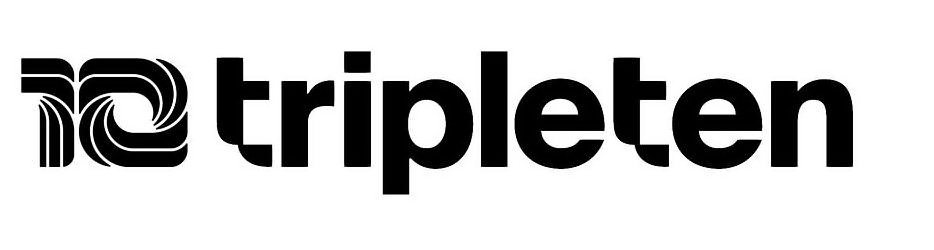

# TripleTen Data Science Bootcamp

[English](#tripleten-data-science-bootcamp) | [Português](#bootcamp-em-ciência-de-dados---tripleten) | [Español](#bootcamp-en-ciencia-de-datos---tripleten)

---

## English

The TripleTen Data Science Bootcamp (February – December 2024) was a transformative, hands-on experience that provided a comprehensive journey through the core areas of data science. Structured in sequential sprints, each module focused on a critical aspect of the field—from basic programming and data manipulation to advanced topics such as machine learning, computer vision, and natural language processing. This curated compilation of projects reflects my rigorous training, significant skill enhancement, and readiness to tackle real-world data challenges. Each sprint represents a milestone in my learning journey and demonstrates the practical application of modern data science techniques.

**Sprints Overview:**

<ol>
  <li><a href="Sprint_1/Python_Basico.ipynb">Sprint 1: Python Basics</a></li>
  <li><a href="Sprint_2/Continuacao_Python_Basico.ipynb">Sprint 2: Python Basics Continued</a></li>
  <li><a href="Sprint_3/README.md">Sprint 3: Data Manipulation</a></li>
  <li><a href="Sprint_4/README.md">Sprint 4: Statistical Data Analysis</a></li>
  <li><a href="Sprint_5/README.md">Sprint 5: Software Development Tools</a></li>
  <li><a href="Sprint_6/README.md">Sprint 6: Integrated Project 1</a></li>
  <li><a href="Sprint_7/README.md">Sprint 7: Data Collection and Storage (SQL)</a></li>
  <li><a href="Sprint_8/README.md">Sprint 8: Introduction to Machine Learning</a></li>
  <li><a href="Sprint_9/README.md">Sprint 9: Supervised Learning</a></li>
  <li><a href="Sprint_10/README.md">Sprint 10: Machine Learning for Business</a></li>
  <li><a href="Sprint_11/README.md">Sprint 11: Linear Algebra</a></li>
  <li><a href="Sprint_12/README.md">Sprint 12: Numerical Methods</a></li>
  <li><a href="Sprint_13/README.md">Sprint 13: Time Series</a></li>
  <li><a href="Sprint_14/README.md">Sprint 14: Machine Learning for Texts</a></li>
  <li><a href="Sprint_15/README.md">Sprint 15: Computer Vision</a></li>
  <li><a href="Sprint_16/README.md">Sprint 16: Unsupervised Learning</a></li>
  <li><a href="Sprint_17/README.md">Sprint 17: Final Project</a></li>
</ol>

---

# Bootcamp em Ciência de dados - TripleTen 
## Português

O Bootcamp de Data Science da TripleTen (fevereiro a dezembro de 2024) foi uma experiência transformadora e prática, que me proporcionou uma jornada completa pelos fundamentos e avanços da ciência de dados. Estruturado em sprints sequenciais, cada módulo abordou aspectos essenciais—desde a introdução à programação e manipulação de dados até tópicos avançados, como aprendizado de máquina, visão computacional e processamento de linguagem natural. Este compilado de projetos comprova o rigor do treinamento e o aprimoramento significativo das minhas competências técnicas, evidenciando minha evolução e capacidade para solucionar desafios reais.

**Visão Geral dos Sprints:**

<ol>
  <li><a href="Sprint_1/README.md">Sprint 1: Python Básico</a></li>
  <li><a href="Sprint_2/README.md">Sprint 2: Continuação de Python Básico</a></li>
  <li><a href="Sprint_3/README.md">Sprint 3: Manipulação de Dados</a></li>
  <li><a href="Sprint_4/README.md">Sprint 4: Análise Estatística de Dados</a></li>
  <li><a href="Sprint_5/README.md">Sprint 5: Ferramentas de Desenvolvimento de Software</a></li>
  <li><a href="Sprint_6/README.md">Sprint 6: Projeto Integrado 1</a></li>
  <li><a href="Sprint_7/README.md">Sprint 7: Coleta e Armazenamento de Dados (SQL)</a></li>
  <li><a href="Sprint_8/README.md">Sprint 8: Introdução ao Aprendizado Automático</a></li>
  <li><a href="Sprint_9/README.md">Sprint 9: Aprendizado Supervisionado</a></li>
  <li><a href="Sprint_10/README.md">Sprint 10: Aprendizado Automático para os Negócios</a></li>
  <li><a href="Sprint_11/README.md">Sprint 11: Álgebra Linear</a></li>
  <li><a href="Sprint_12/README.md">Sprint 12: Métodos Numéricos</a></li>
  <li><a href="Sprint_13/README.md">Sprint 13: Séries Temporais</a></li>
  <li><a href="Sprint_14/README.md">Sprint 14: Aprendizado Automático para Textos</a></li>
  <li><a href="Sprint_15/README.md">Sprint 15: Visão Computacional</a></li>
  <li><a href="Sprint_16/README.md">Sprint 16: Aprendizado Não Supervisionado</a></li>
  <li><a href="Sprint_17/README.md">Sprint 17: Projeto Final</a></li>
</ol>

---
# Bootcamp en Ciencia de Datos - TripleTen
## Español

El Bootcamp de Data Science de TripleTen (febrero a diciembre de 2024) fue una experiencia transformadora y práctica que ofreció un recorrido integral por los fundamentos y avances de la ciencia de datos. Estructurado en sprints secuenciales, cada módulo se enfocó en aspectos críticos—desde la introducción a la programación y manipulación de datos hasta temas avanzados como el aprendizaje automático, la visión por computadora y el procesamiento del lenguaje natural. Este compilado de proyectos demuestra el rigor del entrenamiento y el notable desarrollo de mis competencias técnicas, evidenciando mi evolución y capacidad para afrontar desafíos reales en el mundo de la ciencia de datos.

**Resumen de los Sprints:**

<ol>
  <li><a href="Sprint_1/README.md">Sprint 1: Python Básico</a></li>
  <li><a href="Sprint_2/README.md">Sprint 2: Continuación de Python Básico</a></li>
  <li><a href="Sprint_3/README.md">Sprint 3: Manipulación de Datos</a></li>
  <li><a href="Sprint_4/README.md">Sprint 4: Análisis Estadístico de Datos</a></li>
  <li><a href="Sprint_5/README.md">Sprint 5: Herramientas de Desarrollo de Software</a></li>
  <li><a href="Sprint_6/README.md">Sprint 6: Proyecto Integrado 1</a></li>
  <li><a href="Sprint_7/README.md">Sprint 7: Recolección y Almacenamiento de Datos (SQL)</a></li>
  <li><a href="Sprint_8/README.md">Sprint 8: Introducción al Aprendizaje Automático</a></li>
  <li><a href="Sprint_9/README.md">Sprint 9: Aprendizaje Supervisado</a></li>
  <li><a href="Sprint_10/README.md">Sprint 10: Aprendizaje Automático para los Negocios</a></li>
  <li><a href="Sprint_11/README.md">Sprint 11: Álgebra Lineal</a></li>
  <li><a href="Sprint_12/README.md">Sprint 12: Métodos Numéricos</a></li>
  <li><a href="Sprint_13/README.md">Sprint 13: Series Temporales</a></li>
  <li><a href="Sprint_14/README.md">Sprint 14: Aprendizaje Automático para Textos</a></li>
  <li><a href="Sprint_15/README.md">Sprint 15: Visión Computacional</a></li>
  <li><a href="Sprint_16/README.md">Sprint 16: Aprendizaje No Supervisado</a></li>
  <li><a href="Sprint_17/README.md">Sprint 17: Proyecto Final</a></li>
</ol>
